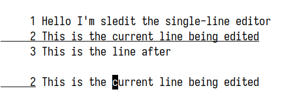

# `sledit`: A single-line-interface editor



## Building and running


```console
$ make
$ make run
```

`sledit` requires a terminal with ANSI-style control sequences.

When run, it expects the terminal to be in "raw mode" with echo off. `make run` sets this "raw mode" up for you.

## Special keys

- <kbd>Ctrl-C</kbd> exits the editor
- <kbd>Ctrl-L</kbd> prints entire buffer
- <kbd>Backspace</kbd> deletes backward
- <kbd>Delete</kbd> deletes forward
- <kbd>Up</kbd> and <kbd>Down</kbd> moves between lines
- <kbd>Right</kbd> and <kbd>Left</kbd> moves forward and backward one character
- <kbd>Home</kbd> and <kbd>End</kbd> goes to start and end of line
